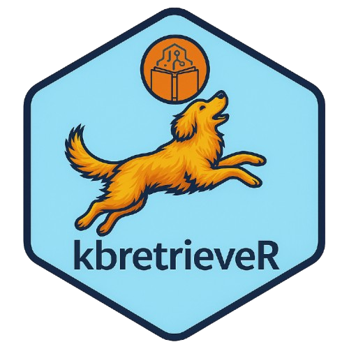
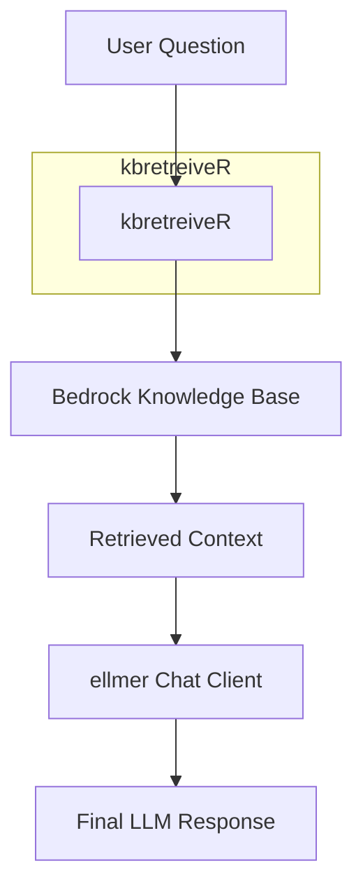

# kbretrieveR <a href="https://lazasaurus-ai.github.io/contextR"></a>


Thin interface for AWS Bedrock Knowledge Bases from R.

**kbretreiveR** retrieves relevant chunks from an AWS Bedrock Knowledge Base, then merges them into the prompt passed to your preferred chat client (e.g. ellmer::chat_aws_bedrock).

## Installation

```r
# from devtools / remotes
remotes::install_github("your-user/kbretrieveR")
```

## Background Info

`kbretreiveR` is an R package that lets you work directly with AWS Knowledge Bases. If your project has a Knowledge Base with project details or coding best practices, you can connect it to `ellmer` and feed that context into your R session. From there, you can generate parameterized Markdown or Quarto documents that automatically incorporate the KB as context.

The package is more than just a chat client—it’s a building block. Its real value comes when you use it in parameterized reports or AI agents. Instead of hard-coding prompts or constantly updating them as information changes, `kbretreiveR` lets your AI workflows dynamically retrieve the latest knowledge base context, ensuring your R agents can generate outputs grounded in up-to-date, project-specific information.


## Quick Start
```r
library(kbretreiveR)

# Create a client (replace with your KB ID & region)
client <- KBClient$new(
  kb_id = "1234ABCE",
  region = "us-east-1",
  chat_client = ellmer::chat_aws_bedrock(
    model = "anthropic.claude-3-5-sonnet-20240620-v1:0"
  )
)

# Retrieve docs
docs <- client$retrieve("Tell me about my companies new projects?")

# Chat with context injected
reply <- client$chat("Summarize in 3 bullet points.")
cat(reply)
```

### Configuration
You can store defaults in your `.Renviron` for convenience similar to `ellmer`:

```r
AWS_ACCESS_KEY_ID = "  "
AWS_SECRET_ACCESS_KEY = "  "
AWS_SESSION_TOKEN = "  "
AWS_REGION = "us-east-1"

AWS_KB_ID="1234ABCE"
```

⚙️ How It Works

